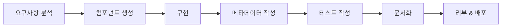

# 🧩 컴포넌트 개발 가이드

## 📋 목차
1. [빠른 시작](#빠른-시작)
2. [컴포넌트 생성](#컴포넌트-생성)
3. [컴포넌트 구조](#컴포넌트-구조)
4. [레지스트리 시스템](#레지스트리-시스템)
5. [개발 워크플로우](#개발-워크플로우)
6. [베스트 프랙티스](#베스트-프랙티스)

## 빠른 시작

### 1. 프로젝트 설정
```bash
# 의존성 설치
npm install

# 개발 서버 시작
npm run dev
```

### 2. 새 컴포넌트 생성
```bash
# 기본 UI 컴포넌트 생성
npm run create:component Button

# 특정 카테고리로 생성
npm run create:component ProductCard --category=feature

# 설명 추가
npm run create:component DataTable --category=composite --description="재사용 가능한 데이터 테이블"
```

## 컴포넌트 생성

### 자동 생성 스크립트
```bash
npm run create:component [ComponentName] [options]
```

**옵션:**
- `--category`: 컴포넌트 카테고리 (ui, feature, layout, composite, chart, form)
- `--description`: 컴포넌트 설명
- `--author`: 작성자 이름

**예시:**
```bash
# UI 컴포넌트
npm run create:component Input --category=ui --description="텍스트 입력 필드"

# Feature 컴포넌트
npm run create:component ShipmentTable --category=feature --description="출고 테이블"

# Layout 컴포넌트
npm run create:component Sidebar --category=layout --description="사이드바 네비게이션"
```

### 생성되는 파일 구조
```
/components/[category]/[component-name]/
├── ComponentName.tsx        # 컴포넌트 구현
├── ComponentName.meta.ts    # 메타데이터 (자동 등록)
├── ComponentName.test.tsx   # 테스트 파일
└── index.ts                # 익스포트
```

## 컴포넌트 구조

### 1. 컴포넌트 파일 (ComponentName.tsx)
```typescript
import * as React from 'react'
import { cn } from '@/lib/utils'

export interface ComponentNameProps {
  // Props 정의
}

const ComponentName = React.forwardRef<HTMLDivElement, ComponentNameProps>(
  ({ className, ...props }, ref) => {
    return (
      <div ref={ref} className={cn('', className)} {...props}>
        {/* 컴포넌트 내용 */}
      </div>
    )
  }
)

ComponentName.displayName = 'ComponentName'

export default ComponentName
```

### 2. 메타데이터 파일 (ComponentName.meta.ts)
```typescript
import { createMetadata } from '@/components/registry/metadata-helpers'

const metadata = createMetadata('ComponentName', 'ui', {
  description: '컴포넌트 설명',
  props: [
    // Props 문서화
  ],
  example: `<ComponentName />`,
  tags: ['tag1', 'tag2'],
})

export default metadata
```

## 레지스트리 시스템

### 컴포넌트 사용 방법

#### 1. 직접 임포트
```typescript
import { Button } from '@/components/ui/button'

<Button variant="primary">클릭</Button>
```

#### 2. 레지스트리에서 가져오기
```typescript
import { useComponent } from '@/components/registry'

const MyPage = () => {
  const Button = useComponent('Button')
  const ProductCard = useComponent('ProductCard')
  
  return (
    <>
      <Button>클릭</Button>
      <ProductCard product={data} />
    </>
  )
}
```

#### 3. 카테고리별 컴포넌트 조회
```typescript
import { useComponentsByCategory } from '@/components/registry'

const uiComponents = useComponentsByCategory('ui')
const featureComponents = useComponentsByCategory('feature')
```

## 개발 워크플로우

### 1. 컴포넌트 개발 프로세스


### 2. 컴포넌트 체크리스트
- [ ] 컴포넌트 생성 (`npm run create:component`)
- [ ] Props 인터페이스 정의
- [ ] 기본 스타일 적용
- [ ] 메타데이터 업데이트
- [ ] 사용 예시 작성
- [ ] 테스트 작성
- [ ] 접근성 검증
- [ ] 반응형 디자인 확인

### 3. 레지스트리 업데이트
```bash
# 레지스트리 수동 업데이트
npm run registry:update

# 레지스트리 검증
npm run registry:validate
```

## 베스트 프랙티스

### 1. 명명 규칙
- **컴포넌트명**: PascalCase (예: `ProductCard`, `DataTable`)
- **파일명**: PascalCase (예: `ProductCard.tsx`)
- **디렉토리명**: kebab-case (예: `product-card`)
- **Props 인터페이스**: ComponentNameProps (예: `ProductCardProps`)

### 2. Props 설계
```typescript
// ✅ 좋은 예
interface ButtonProps extends React.ButtonHTMLAttributes<HTMLButtonElement> {
  variant?: 'primary' | 'secondary'
  size?: 'sm' | 'md' | 'lg'
  loading?: boolean
}

// ❌ 나쁜 예
interface ButtonProps {
  style: any  // 구체적이지 않음
  type: string  // 열거형이 더 나음
  onClick: Function  // 타입이 명확하지 않음
}
```

### 3. 스타일링
```typescript
// Tailwind CSS + cn 유틸리티 사용
import { cn } from '@/lib/utils'

<div className={cn(
  'base-styles',
  variant === 'primary' && 'primary-styles',
  size === 'lg' && 'large-styles',
  className  // 사용자 정의 클래스 허용
)} />
```

### 4. 접근성
- 시맨틱 HTML 사용
- ARIA 속성 적절히 사용
- 키보드 네비게이션 지원
- 스크린 리더 호환성

### 5. 성능 최적화
```typescript
// React.memo로 불필요한 리렌더링 방지
export default React.memo(ComponentName)

// 큰 컴포넌트는 lazy loading
const HeavyComponent = lazy(() => import('./HeavyComponent'))
```

### 6. 테스트
```typescript
import { render, screen } from '@testing-library/react'
import { ComponentName } from './'

describe('ComponentName', () => {
  it('renders correctly', () => {
    render(<ComponentName />)
    // 테스트 구현
  })
  
  it('handles user interaction', () => {
    // 사용자 상호작용 테스트
  })
})
```

## 폴더 구조 예시

```
/components
├── /registry           # 레지스트리 시스템
│   ├── ComponentRegistry.ts
│   ├── components.json
│   └── index.ts
├── /ui                 # 기본 UI 컴포넌트
│   ├── /button
│   ├── /input
│   └── /table
├── /feature           # 기능 컴포넌트
│   ├── /product-selector
│   ├── /shipment-table
│   └── /inventory-grid
├── /layout            # 레이아웃 컴포넌트
│   ├── /sidebar
│   └── /header
└── /composite         # 조합 컴포넌트
    ├── /data-table
    └── /form-builder
```

## 자주 사용하는 명령어

```bash
# 컴포넌트 생성
npm run create:component [name] [--options]

# 레지스트리 업데이트
npm run registry:update

# 레지스트리 검증
npm run registry:validate

# 개발 서버
npm run dev

# 타입 체크
npm run typecheck

# 린트
npm run lint

# 빌드
npm run build
```

## 문제 해결

### 컴포넌트가 레지스트리에 등록되지 않음
1. `components.json` 파일 확인
2. 메타데이터 파일이 올바르게 작성되었는지 확인
3. `npm run registry:update` 실행

### 타입 에러 발생
1. `npm run typecheck`로 상세 에러 확인
2. Props 인터페이스 정의 확인
3. tsconfig.json 경로 설정 확인

### 스타일이 적용되지 않음
1. Tailwind CSS 클래스 정확성 확인
2. `cn()` 유틸리티 사용 확인
3. tailwind.config.js content 경로 확인

---

이 가이드는 지속적으로 업데이트됩니다. 질문이나 개선 제안이 있으면 이슈를 생성해주세요.